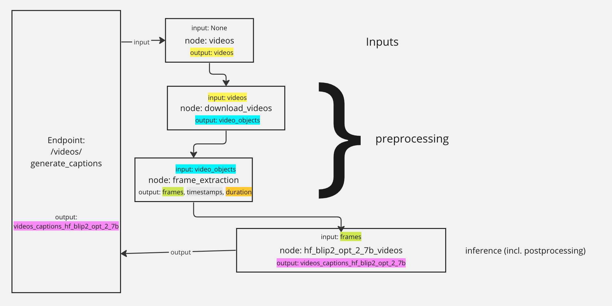

# Aana SDK Getting Started

This is the living version of this document. A [previous draft](https://docs.google.com/document/d/1z1y7Gxo1RwL_9MyTzRVvwA6tsOaVz8JKzlOA9Bxq2FU/edit#heading=h.70hndo88ymuh) lived on Google Docs.


## Code overview

    aana/ - top level source code directory for the project

        alembic/ - directory for database automigration

            versions/ - individual migrations

        api/ - code for generating an API from deployment and endpoint configurations

        config/ - various configuration, including settings, but also config for deployments & endpoints

            build.py - functionality to build the pipeline

            db.py - config for the database

            deployments.py - config for available deployment targets

            endpoints.py -  associations deployment targets with associated endpoints

            pipeline.py - pipeline nodes for SDK

            settings.py - app settings

        deployments/ - classes for individual ray deployments to wrap models or other functionality for ray

        exceptions/ - custom exception classes

        models/ - model classes for data

            core/ - core data models for the SDK

            db/ - database models (SQLAlchemy)

            pydantic/ - pydantic models (web request inputs + outputs, other data)

        repository/ - repository classes for storage

            datastore/ - repositories for structured databases (SQL)

            vectorstore/ - repositories for vector databases (Qdrant) (TODO)

        tests/ - automated tests for the SDK

            db/ - tests for database functions

            deployments/ - tests for model deployments

            files/ - files used for tests

        utils/ - various utility functionality

            chat_templates/ - templates for chat models

        main.py - entry point for the application


## Adding a New Model

A ray deployment is a standardized interface for any kind of functionality that needs to manage state (primarily, but not limited to, an AI model that needs to be fetched and loaded onto a GPU). New deployments should inherit from aana.deployments.base_deployment.BaseDeployment, and be in the aana/deployments folder. Additionally, a deployment config for the deployment will have to be added to the aana/configs/deployments.py file. Here's a simple example using Stable Diffusion 2:

aana/configs/deployments.py:
```python
deployments = {
    "stablediffusion2_deployment": StableDiffusion2Deployment.options(
        num_replicas=1,
        max_concurrent_queries=1000,
        ray_actor_options={"num_gpus": 1},
        user_config=StableDiffusion2Config(
            model="stabilityai/stable-diffusion-2", dtype=Dtype.FLOAT16
        ).dict(),
    ),
}
```
aana/deployments/stablediffusion2_deployment.py:
```python
from typing import TYPE_CHECKING, Any, TypedDict

import torch
from diffusers import EulerDiscreteScheduler, StableDiffusionPipeline
from pydantic import BaseModel, Field
from ray import serve

from aana.deployments.base_deployment import BaseDeployment
from aana.models.core.dtype import Dtype
from aana.models.core.image import Image
from aana.models.pydantic.prompt import Prompt

if TYPE_CHECKING:
    import PIL


class StableDiffusion2Config(BaseModel):
    """The configuration for the StableDiffusion 2 deployment with HuggingFace models.

    Attributes:
        model (str): the model ID on HuggingFace
        dtype (str): the data type (optional, default: "auto"), one of "auto", "float32", "float16"
    """

    model: str
    dtype: Dtype = Field(default=Dtype.AUTO)


class StableDiffusion2Output(TypedDict):
    """Output class."""

    image: Any


@serve.deployment
class StableDiffusion2Deployment(BaseDeployment):
    """Deployment to serve Stable Diffusion models using HuggingFace."""

    async def apply_config(self, config: dict[str, Any]):
        """Apply the configuration.

        The method is called when the deployment is created or updated.

        It loads the model and processor from HuggingFace.

        The configuration should conform to the StableDiffusion2Config schema.
        """
        config_obj = StableDiffusion2Config(**config)

        # Load the model and scheduler from HuggingFace
        self.model_id = config_obj.model
        self.dtype = config_obj.dtype
        self.torch_dtype = self.dtype.to_torch()
        self.device = "cuda" if torch.cuda.is_available() else "cpu"
        self.model = StableDiffusionPipeline.from_pretrained(
            self.model_id,
            torch_dtype=self.torch_dtype,
            scheduler=EulerDiscreteScheduler.from_pretrained(
                self.model_id, subfolder="scheduler"
            ),
        )
        self.model.to(self.device)

    async def generate(self, prompt: Prompt) -> StableDiffusion2Output:
        """Generate image for the given prompt.

        Args:
            prompt (Prompt): the prompt

        Returns:
            StableDiffusion2Output: the output
        """
        result: PIL.Image = self.model(str(prompt)).images[0]

        return {"image": Image(content=result.tobytes())}
```

Now you have a deployment! The next step is to add pipeline nodes so the deployment can be called.

## Add pipeline nodes

For this simple pipeline, we only need three nodes:

1. Get the prompt from the input
2. Generate an image from a prompt using Stable Diffusion 2
2. Save the image to the disk and return the path

Step 3 is actually only necessary because the SDK doesn't return binary files yet. At some point we expect this to be supported, so then this would only need two steps to run.

Here are nodes we need (`aana/configs/pipeline.py`):
```python
nodes = [
    {
        "name": "prompt",
        "type": "input",
        "inputs": [],
        "outputs": [
            {"name": "prompt", "key": "prompt", "path": "prompt", "data_model": Prompt}
        ],
    },
    {
        "name": "stablediffusion2-imagegen",
        "type": "ray_deployment",
        "deployment_name": "stablediffusion2_deployment",
        "method": "generate",
        "inputs": [
            {
                "name": "prompt",  # name is taken from the same namespace as output (see above)
                "key":"prompt",  # 'key' is what the argument is called in the method or function
                "path": "prompt",  # this is a data path for hierarchically structured data
                "data_model": Prompt  # Specifying a data model helps generate better documentation
        }],
        "outputs": [
            {"name": "image_stablediffusion2",  # How we identify this output uniquely
            "key": "image",  # If method returns a dict, what key on that dict to look up
            "path": "image"  # Where to place this value in a data object hierarchy
            }
        ]
    },
    {
        "name": "save_image_stablediffusion2",
        "type": "function",
        "function": "aana.utils.image.save_image",  # Could also be a function in a library
        "inputs": [
            {
                "name": "image_stablediffusion2",  # matches output of the previous node
                "key": "image",  # matches the name of an argument to the function
                "path": "image"  # where the data is located in the object hierarchy
            },
        ],
        "outputs": [
            {
                "name":"image_path_stablediffusion2",  # unique name
                "key": "path",  # key on return dictionary
                "path": "image_path"  # what the value is called in the object hierarchy
            }
        ]
    }
]
```

Then we need to define an endpoint so Aana knows how to call the pipeline from a web request. 

```python
from aana.api.api_generation import Endpoint, EndpointOutput

endpoints = {
    "stablediffusion2": [
        Endpoint(
            name="imagegen",
            path="/imagegen",
            summary="Generate image using Stable Diffusion 2",
            outputs=[
                EndpointOutput(
                    name="path",  # key/label on response object
                    output="image_path_stablediffusion2"  # name of output to use
                )
            ],
        )
    ],
```

Finally, we need to write the save_image function we referenced above (`aana/utils/image.py`)

```python
from pathlib import Path
from uuid import uuid4

from aana.configs.settings import settings
from aana.models.core.image import Image


def save_image(image: Image) -> dict[str, Path]:
    """Saves an Image to a the tmp data dir."""
    base_dir = settings.tmp_data_dir
    filetype = "png"
    filename = f"{uuid4()}.{filetype}"
    full_path = base_dir / filename
    image.save_from_content(full_path)
    return {"path": full_path}  
```

# More complicated - Blip2 video captioning

Here's a more complicated example for video captioning.

```python
deployments = {
   ...
    "hf_blip2_deployment_opt_2_7b": HFBlip2Deployment.options(
        num_replicas=1,  # How many instances should be started
        max_concurrent_queries=1000,  
        # Ray will count available GPUs and reserve according to this value
        # DOES NOT actually restrict model's ability to consume VRAM
        ray_actor_options={"num_gpus": 0.25}, 
        user_config=HFBlip2Config(
            model="Salesforce/blip2-opt-2.7b",  # from HuggingFace
            dtype=Dtype.FLOAT16,  # data type for the model
            batch_size=2,  # batch size for the model
            num_processing_threads=2,  # how many threads can model consume?
        ).dict(),
    ),
```
aana/deployments/hfblip2_deployment.py:

```python
class HFBlip2Config(BaseModel):  # BaseModel makes sure it's serializeable
    """The configuration for the BLIP2 deployment with HuggingFace models.

    Attributes:
        model (str): the model ID on HuggingFace
        dtype (str): the data type (optional, default: "auto"), one of "auto", "float32", "float16"
        batch_size (int): the batch size (optional, default: 1)
        num_processing_threads (int): the number of processing threads (optional, default: 1)
    """

    model: str
    dtype: Dtype = Field(default=Dtype.AUTO)
    batch_size: int = Field(default=1)
    num_processing_threads: int = Field(default=1)


@serve.deployment  # lets Ray know this is a deployment class
class HFBlip2Deployment(BaseDeployment):
    """Deployment to serve BLIP2 models using HuggingFace."""

    async def apply_config(self, config: dict[str, Any]):
        """Sets up the deployment."""
        config_obj = HFBlip2Config(**config)

	    # We have to do two things here: prepare the model itself to run,
        # and set up the batch processor
        # 1. Load the model from HuggingFace into PyTorch
        self.model_id = config_obj.model
        self.dtype = config_obj.dtype
        if self.dtype == Dtype.INT8:
            load_in_8bit = True
            self.torch_dtype = Dtype.FLOAT16.to_torch()
        else:
            load_in_8bit = False
            self.torch_dtype = self.dtype.to_torch()
        self.device = "cuda" if torch.cuda.is_available() else "cpu"
        self.model = Blip2ForConditionalGeneration.from_pretrained(
            self.model_id,
            torch_dtype=self.torch_dtype,
            load_in_8bit=load_in_8bit,
            device_map=self.device,
        )
        self.model = torch.compile(self.model)
        self.model.eval()
        # 2. Set up batch processing (optional but recommended)
        self.processor = Blip2Processor.from_pretrained(self.model_id)
        self.model.to(self.device)
        self.batch_size = config_obj.batch_size
        self.num_processing_threads = config_obj.num_processing_threads
        # The actual inference is done in _generate()
        # We use lambda because BatchProcessor expects dict as input
        # and we use **kwargs to unpack the dict into named arguments for _generate()
        self.batch_processor = BatchProcessor(
            process_batch=lambda request: self._generate(**request),
            batch_size=self.batch_size,
            num_threads=self.num_processing_threads,
        )


    # This deployment can be run in two ways: on a batch or on a single item
    # Running on a single item just creates a batch of one.
    async def generate(self, image: Image) -> CaptioningOutput:
        """Generate captions for the given image.

        Args:
            image (Image): the image

        Returns:
            CaptioningOutput: the dictionary with one key "captions"
                            and the list of captions for the image as value

        Raises:
            InferenceException: if the inference fails
        """
        captions: CaptioningBatchOutput = await self.batch_processor.process(
            {"images": [image]}
        )
        return CaptioningOutput(caption=captions["captions"][0])

    async def generate_batch(self, **kwargs) -> CaptioningBatchOutput:
        """Generate captions for the given images.

        Args:
            images (List[Image]): the images
            **kwargs (dict[str, Any]): keywordarguments to pass to the
                batch processor.

        Returns:
            CaptioningBatchOutput: the dictionary with one key "captions"
                            and the list of captions for the images as value

        Raises:
            InferenceException: if the inference fails
        """
        # Call the batch processor to process the requests
        # The actual inference is done in _generate()
        return await self.batch_processor.process(kwargs)

    # In this case all the inference work is done by this non-public function.
    def _generate(self, images: list[Image]) -> CaptioningBatchOutput:
        """Generate captions for the given images.

        This method is called by the batch processor.

        Args:
            images (List[Image]): the images

        Returns:
            CaptioningBatchOutput: the dictionary with one key "captions"
                            and the list of captions for the images as value

        Raises:
            InferenceException: if the inference fails
        """
        # Loading images
        numpy_images = [im.get_numpy() for im in images]
        inputs = self.processor(numpy_images, return_tensors="pt").to(
            self.device, self.torch_dtype
        )

        try:
            generated_ids = self.model.generate(**inputs)
            generated_texts = self.processor.batch_decode(
                generated_ids, skip_special_tokens=True
            )
            generated_texts = [
                generated_text.strip() for generated_text in generated_texts
            ]
            return CaptioningBatchOutput(captions=generated_texts)
        except Exception as e:
            raise InferenceException(self.model_id) from e
```

That is our production deployment. As before, we must add pipeline nodes to be able to call it.

## Adding Pipeline Nodes

A typical workflow with one inference stage might be:

1. input - says which input to get from a request
2. preprocessing - turning the HTTP request into something you can use (download files, etc)
3. inference - running on the ML model
4. postprocessing - making the response something useful for a human to see (sometimes included in inference)

(Not shown for simplicity: video processing params on the input, saving to the database)



Here's an example of these for a video processing pipeline(aana/config/pipeline.py):
```python
# Input
    {
        "name": "videos",  # node names must be unique
        "type": "input",  # comes from request inputs
        "inputs": [],  # no antecedents (because it comes from request)
        "outputs": [
            {
                "name": "videos",  # No other node can have the same output name
                "key": "videos",  # Return value is a dict. this is the name of the key
                "path": "video_batch.videos.[*].video_input",  # "path" tells ray how to store & find data object
                "data_model": VideoInputList,  # Optional but recommended - helps with generating documentation
            }
        ],
    },
# Preprocessing 1 (download video)
    {
        "name": "download_videos",
        # ray_task is a specially wrapped function. Can also just be "function"
        "type": "ray_task",
        # Import path and name for the function. Could also be something like 
        # "numpy.linalg.norm"
        "function": "aana.utils.video.download_video",
        # If a node (ray task or deployment or function) is to be called on a 
        # single item but the input is a collection, set "batched": True.
        # Otherwise function is called on the collection as a whole.
        "batched": True,
        # Pipeline expects a dict in response, however for functions (such as 
        # numpy.linalg.norm) that just return a value, "dict_output": True
        # tells the pipeline the value isn't wrapped
        "dict_output": False,
        "inputs": [  # List of inputs here should match the function signature
            {
                "name": "videos",  # matches named output above!
                "key": "video_input",  # name of argument to function
                "path": "video_batch.videos.[*].video_input",
                # If you wish to "unwrap" a collection of a sub-object - for
                # example you have a batch of videos and each video has a 
                # series of frames, you can do all the frames of all the videos
                # in one step with "flatten_by". The last [*] is the argument
                # to be flattened.
                "flatten_by": "video_batch.videos.[*]",
            },
        ],
        "outputs": [
            {
                "name": "video_objects",
                "key": "output",
                "path": "video_batch.videos.[*].video",
            },
        ],
    },
# Preprocessing 2 (extract frames)
    {
        "name": "frame_extraction",
        "type": "ray_task",
        "function": "aana.utils.video.extract_frames_decord",
        "batched": True,
        "flatten_by": "video_batch.videos.[*]",
        "inputs": [
            {
                "name": "video_objects",
                "key": "video",
                "path": "video_batch.videos.[*].video",
            },
            {"name": "video_params", "key": "params", "path": "video_batch.params"},
        ],
        "outputs": [
            {
                "name": "frames",
                "key": "frames",
                "path": "video_batch.videos.[*].frames.[*].image",
            },
            {
                "name": "frame_ids",
                "key": "frame_ids",
                "path": "video_batch.videos.[*].frames.[*].id",
            },
            {
                "name": "timestamps",
                "key": "timestamps",
                "path": "video_batch.videos.[*].timestamp",
            },
            {
                "name": "duration",
                "key": "duration",
                "path": "video_batch.videos.[*].duration",
            },
        ],
    }

# Inference - because this is a batch, inputs and outputs are lists
    {
        "name": "hf_blip2_opt_2_7b_videos",
        "type": "ray_deployment",  # Ray deployment
        "deployment_name": "hf_blip2_deployment_opt_2_7b",  # key from config/deployments.py
        "method": "generate_batch",  # name of the method on the class to be called
        "inputs": [
            {
                "name": "frames",
                "key": "images",
                "path": "video_batch.videos.[*].frames.[*].image",
            }
        ],
        "outputs": [
            {
                "name": "videos_captions_hf_blip2_opt_2_7b",
                "key": "captions",
                "path": "video_batch.videos.[*].frames.[*].caption_hf_blip2_opt_2_7b",
                "data_model": VideoCaptionsList,
            }
        ],
    }
# Postprocessing - e.g. saving to DB
{
        "name": "save_video_captions_hf_blip2_opt_2_7b",
        "type": "function",  # This is a regular function, not a wrapped one
        "function": "aana.utils.db.save_video_captions",
        # you can pass arbitrary additional arguments to the function with
        # "kwargs" in the configuration
        "kwargs": {
            "model_name": "hf_blip2_opt_2_7b",
        },
        "inputs": [
            {
                "name": "videos_captions_hf_blip2_opt_2_7b",
                "key": "captions",
                "path": "video_batch.videos.[*].frames.[*].caption_hf_blip2_opt_2_7b",
            },
            {
                "name": "videos_timestamps",
                "key": "timestamps",
                "path": "video_batch.videos.[*].timestamps",
            },
            {
                "name": "videos_frame_ids",
                "key": "frame_ids",
                "path": "video_batch.videos.[*].frames.[*].id",
            },
        ],
        "outputs": [
            {
                "name": "captions_ids",
                "key": "caption_ids",
                "path": "video_batch.videos.[*].frames.[*].caption_hf_blip2_opt_2_7b.id",
            }
        ],
    }
```

## Adding endpoints

Now we're almost done. The last stage is to add a run target with endpoints that refer to the node inputs and outputs (aana/config/endpoints.py).

```python
endpoints = {
    "blip2": [
        Endpoint(
            # Name of the endpoint
            name="blip2_video_generate",
            # URL for the endpoint on the local server
            path="/video/generate_captions",
            # Summary (for documentation)
            summary="Generate captions for videos using BLIP2 OPT-2.7B",
            outputs=[
                # Only specified outputs will be included in the response.
                # Any data produced but not used in the output or a step
                # leading up to the output may be discarded at any time!
                # The inputs are determined by "backtracking" the pipeline
                # graph to determine what is required for it to run.
                EndpointOutput(
                    name="captions", output="videos_captions_hf_blip2_opt_2_7b"
                ),
                EndpointOutput(name="timestamps", output="videos_timestamps"),
            ],
        ),
    ]
}
```

Okay, can you figure out what we might have forgotten? 

We created a postprocessing step to save the video captions to the DB, but since we didn't include its output in the endpoint definition ("captions_ids"), that step **won't** run. It will get the output of the captions model, determine that no more steps are needed, and return it to the user. A working endpoint that wanted to include `EndpointOutput(name="caption_ids", output="caption_ids")` in the list of outputs.


## Saving to a DB

Aana SDK is designed to have two databases, a structured database layer with results/metadata (datastore) and a vector database for search, etc (vectorstore).


### Saving to datastore

You will need to add database entity models as a subclass of `aana.models.db.base.BaseEntity` to a class file in `aana/models/db/`. Additionally, to avoid import issues, you will need to import that model inside `aana/models/db/__init__.py`.

Once you have defined your model, you will need to create an alembic migration to create the necessary table and modify other tables if necessary. Do this just by running

```bash
poetry run alembic revision --autogenerate -m "Add captions table."
```

The app will automatically run the migration when you start up, so the rest is taken care of.


### Repositories and Helper functions

We wrap access to the datastore in a repository class. There is a generic BaseRepository that provides the following methods: create, create_multiple, read (by id), delete (by id). If you want to fetch by another parameter (for example by a parent object id). Update logic is TODO since the semantics of in-place updates with the SqlAlchemy ORM is a bit complex.

(aana/repository/datastore/caption_repository.py)

```python
class CaptionsRepository(BaseRepository[CaptionEntity]):
    """Repository for Captions."""

    def __init__(self, session: Session):
        """Constructor."""
        super().__init__(session, CaptionEntity)
```

That's it! 

To make a repository work with the pipeline, it's easiest to wrap the repository actions in helper functions, like so (aana/utils/db.py):

```python
from sqlalchemy.orm import Session
# Import entities from aana.models.db, not the file where they are defined!
from aana.models.db import CaptionsEntity 
from aana.models.pydantic.captions import VideoCaptionsList
# An engine is needed for opening a Session
from aana.repository.datastore.engine import engine
from aana.repository.datastore.caption_repo import CaptionRepository

def save_captions_batch(
    captions: VideoCaptionsList, 
) -> dict:
    """Saves a batch of videos to datastore."""
    caption_entities = [CaptionEntity(**item) for item in captions]

    with Session(engine) as session:
        captions_repo = CaptionRepository(session)

        captions = captions_repo.create_multiple(caption_entities)
        return {
            "caption_ids": [b.id for b in captions]
        }
```

## Vectorstore

TODO


### Running the SDK

So, you have created a new deployment for your model, defined the pipeline nodes for it, and created the endpoints to call it. How do you run the SDK?

The "normal" way to run the SDK right now is to call the SDK as a module with following syntax:

```bash
poetry run python aana --host 0.0.0.0 --port 8000 --target blip2
```

Host and port are optional; the defaults are `0.0.0.0` and `8000`, respectively, but you must give a deployment target or the SDK doesn't know what to run. Once the SDK has initialized the pipeline, downloaded any remote resources necessary, and loaded the model weights, it will print "Deployed Serve app successfully." and that is the cue that it is ready to serve traffic and perform tasks, including inference.  Documentation is also automatically generated and available at http://{port}:{host}/docs and http://{port}:{host}/redoc, depending on which format you prefer.


## Tests

Write unit tests for every freestand function or task function you add. Write unit tests for deployment methods or static functions that transform data without sending it to the inference engine (and refactor the deployment code so that as much functionality as possible is modularized so that it may be tested). 

Additionally, please write some tests for the `tests/deployments` folder that will load your deployment and programmatically run some inputs through it to validate that the deployment itself works as expected. Note, however, that due to the size and complexity of loading deployments that this might fail even if the logic is correct, if for example the user is running on a machine a GPU that is too small for the model.

You can tell PyTest to skip tests under certain conditions. For example, if there is a deployment that doesn't make sense to run without a GPU, you can use the decorator `@pytest.mark.skipif(not is_gpu_available(), reason="GPU is not available")` to tell pytest not to run it if there's no GPU available. The function `is_gpu_available()` is defined in aana.tests.utils.py.

Additionally, you can use mocks to test things like database logic, or other code that would normally require extensive external functionality to test. For example, here is code that mocks out database calls so it can be run as a deployment without needed to load the model:

```python
@pytest.fixture
def mocked_session(mocker):
    """Creates a mocked sqlalchemy.Session."""
    session = mocker.MagicMock(spec=Session)
    # Emulate the behavior of the empty database.
    session.query.return_value.filter_by.return_value.first.return_value = None
    return session

def test_create_caption(mocked_session):
    """Tests caption creation."""
    # "mocked_session" mocks all the database operations, so we have a 
    # repo object that automatically skips those and only checks the repo logic
    repo = CaptionRepository(mocked_session)
    # Make up a fake video with metadata
    media_id = "foo"
    media_type = "video"
    video_duration = 500.25
    model_name = "no_model"
    caption_text = "This is the right caption text."
    frame_id = 32767
    timestamp = 327.6
    _ = MediaEntity(id=media_id, media_type=media_type)
    video = VideoEntity(media_id=media_id, duration=video_duration)
    caption = CaptionEntity(
        media_id=media_id,
        video=video,
        model=model_name,
        frame_id=frame_id,
        caption=caption_text,
        timestamp=timestamp,
    )

    # All that just so we can test one call!
    caption2 = repo.create(caption)

    # Then assert to validate our assumptions: the video returned from `create`
    # is unchanged (we don't check that an id has been set because only a real db
    # can do that)
    assert caption2.video == video
    assert caption2.media_id == media_id
    assert caption2.video_id == video.id
    assert caption2.model == model_name
    assert caption2.frame_id == frame_id
    assert caption2.caption == caption_text
    assert caption2.timestamp == timestamp

    # And we check that the correct underly calls, in the correct numbers, 
    # on the session object have been made
    mocked_session.add.assert_called_once_with(caption)
    mocked_session.commit.assert_called_once()
```
